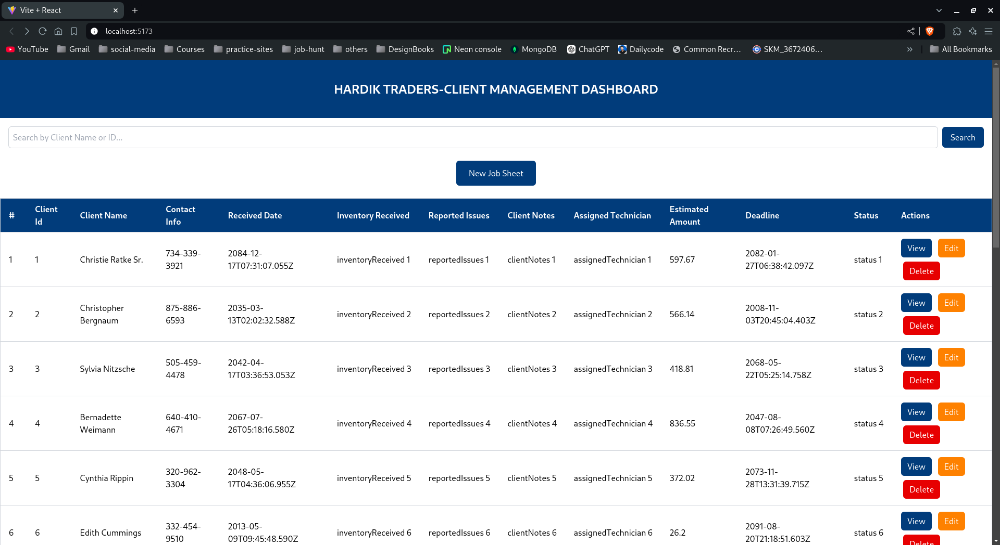
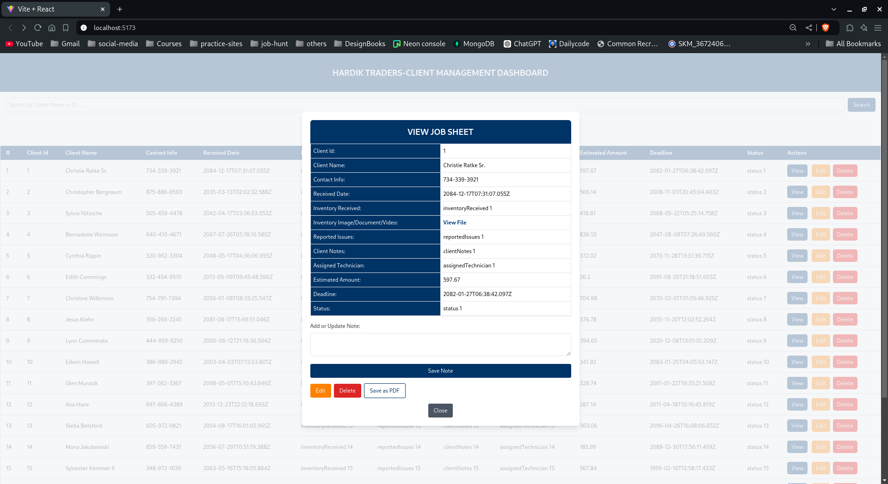
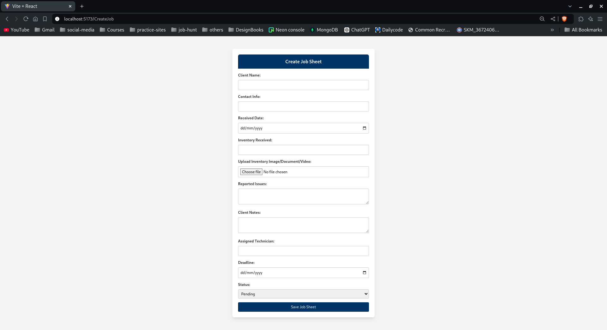
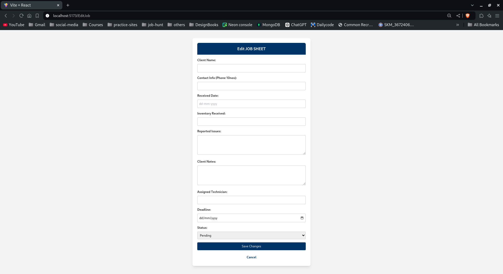

# Job Sheet Management Dashboard

This is a full-stack web application to manage job sheets, clients, and inventory, built with **React**, **Express.js**, **MongoDB**, and **Node.js**. The dashboard allows users to create, edit, delete, and view job sheets with functionality for file uploads and status tracking.

# Screenshots







## Table of Contents

- [Features](#features)
- [Tech Stack](#tech-stack)
- [Installation](#installation)
- [Running the App](#running-the-app)
- [Environment Variables](#environment-variables)
- [Usage](#usage)
- [API Endpoints](#api-endpoints)
- [Contributing](#contributing)

## Features

- Create new job sheets
- Edit and view job details
- Upload files (images, documents, videos)
- Delete job sheets
- Search by client name or client ID
- Responsive UI using Tailwind CSS
- Save job sheets as PDF

## Tech Stack

- **Frontend**: React, Tailwind CSS
- **Backend**: Node.js, Express.js
- **Database**: MongoDB (Mongoose)
- **Other**: Axios, Multer (for file uploads)

## Installation

### Prerequisites

Make sure you have the following installed:

- [Node.js](https://nodejs.org/) (version 14.x or higher)
- [MongoDB](https://www.mongodb.com/) (running locally or a cloud instance like MongoDB Atlas)

### Steps

1. **Clone the Repository**:

   ```bash
   git clone https://github.com/your-username/job-sheet-dashboard.git
   cd job-sheet-dashboard


2. **Install the node modules in both the frontend and Backend**

    ```bash
    npm install 

3.**Setup env file providing MongoDB URL**

    ```bash
    cd server
    touch .env
    ```
# .env
MONGO_URI="Your mongo url"
